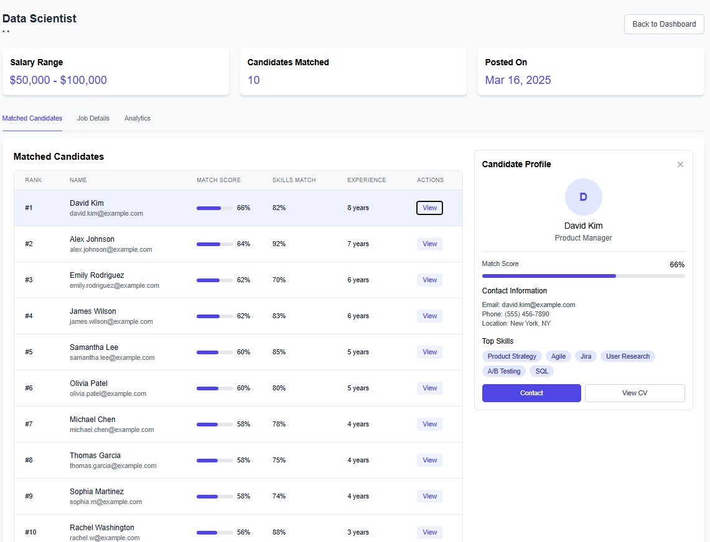

# JD_CV - Automated Recruitment Matching System


JD_CV is an AI-powered automated recruitment system designed to streamline the hiring process by accurately matching job descriptions with candidate CVs. Leveraging state-of-the-art NLP models and a robust technical architecture, JD_CV extracts and aligns crucial data to ensure recruiters find the perfect fit, while job seekers receive targeted opportunities.

---

## Table of Contents

- [Key Features](#key-features)
- [Project Structure](#project-structure)
- [Technical Architecture](#technical-architecture)
- [Requirements](#requirements)
- [Setup & Installation](#setup--installation)
- [Usage](#usage)
- [Screenshots](#screenshots)
- [Roadmap](#roadmap)
- [License](#license)
- [Contributing](#contributing)
- [Contact](#contact)

---

## Key Features

- **Automated Data Extraction:** Utilize advanced LLMs (e.g., Mistral-large-2411) to extract key details from resumes and job descriptions.
- **Smart Matching Algorithm:** Domain-specific embeddings (JobBERT) and cosine similarity for precise candidate-job matching.
- **Scalable Architecture:** Built for high-volume data handling with parallel processing and distributed storage.
- **User-Centric Dashboards:** Intuitive UIs built with React, Flask, and Streamlit for both candidates and recruiters.
- **Real-Time Feedback:** Immediate insights and ranking to accelerate the hiring process.

---

## Project Structure

```
├── frontend
│   ├── src
│   ├── public
│   └── package.json         # React application files
├── backend
│   ├── app.py               # Flask API endpoints
│   ├── main.py              # Streamlit app for visualization
│   └── requirements.txt     # Python dependencies
├── models
│   ├── mistral-large-2411   # LLM model files
│   └── jobbert              # Domain-specific embeddings
├── data
│   └── sample_data          # Example CVs & job descriptions
├── images
│   ├── architecture_diagram.png   # Architecture Diagram
│   └── data_flow_diagram.png      # Data Flow & Matching Pipeline Diagram
└── README.md
```

---

## Technical Architecture

JD_CV's multi-layered architecture is designed for speed, scalability, and precision:

1. **Data Ingestion & Preprocessing:**
   - Automated collection of CVs and job descriptions.
   - Data cleaning and normalization via API Gateway.

2. **Feature Extraction:**
   - **Mistral-large-2411:** Extracts detailed insights using QA-driven prompts.
   - **JobBERT Embeddings:** Converts text into high-dimensional vectors for robust matching.

3. **Data Storage & Processing:**
   - Leverages distributed storage (e.g., Hadoop, Spark) and parallel processing to handle large volumes of data.

4. **Matching & Ranking:**
   - Uses cosine similarity between embeddings to rank candidates, ensuring the best fit for each role.

5. **User Interfaces:**
   - **Frontend:** React-based portal for candidates and recruiters.
   - **Backend:** Flask APIs and a Streamlit dashboard for data visualization and interaction.

---

## Requirements

### Frontend (React)

- **Node.js:** v16+
- **npm/Yarn:** Latest version
- **React:** v18+
- **Additional Libraries:**
  - `react-icons`
  - `axios`

### Backend (Flask/Streamlit)

- **Python:** 3.9+
- **Flask:** 2.2+
- **Streamlit:** 1.20+
- **Additional Libraries:**
  - `sqlalchemy`
  - `pandas`

### Additional Dependencies

- **NLP Model Files:** Access to Mistral-large-2411 and JobBERT embeddings.
- **Distributed Data Processing:** (Optional) Hadoop/Spark cluster configuration for production workloads.

---

## Setup & Installation

1. **Clone the Repository**

   ```bash
   git clone https://github.com/SafalBhandari12/jd_cv.git
   cd jd_cv
   ```

2. **Frontend Setup**

   ```bash
   cd frontend
   npm install
   npm start
   ```

   The React app will run at [http://localhost:3000](http://localhost:3000).

3. **Backend Setup**

   ```bash
   cd ../backend
   pip install -r requirements.txt
   python app.py
   ```

   The Flask server will run at [http://localhost:5000](http://localhost:5000).

4. **Optional: Launch Streamlit Dashboard**

   ```bash
   streamlit run main.py
   ```

   Access the Streamlit app at [http://localhost:8501](http://localhost:8501).

---

## Usage



JD_CV automates the recruitment process by:

- **Extracting Key Information:** Automate data extraction from CVs and job descriptions.
- **Smart Matching:** Rank candidates based on how well their profiles align with job requirements.
- **Real-Time Feedback:** Provide actionable insights to both recruiters and candidates.

Test API endpoints using tools like Postman or curl, and interact with the dashboards to visualize data flow and matching outcomes.

---


## Roadmap

- **Short-Term:**
  - Enhance real-time analytics for recruiter dashboards.
  - Integrate additional NLP models to cover more job sectors.

- **Mid-Term:**
  - Implement multi-language support.
  - Optimize parallel processing for large-scale data ingestion.

- **Long-Term:**
  - Develop a recommendation engine for career progression.
  - Integrate advanced machine learning for deeper candidate insights.

---

## License

This project is distributed under the [MIT License](./LICENSE). Feel free to modify and use it as per the license terms.

---

## Contributing

Contributions are welcome! Please fork the repository and submit a pull request. For major changes, open an issue first to discuss your ideas.

---

## Contact

**Project Link:** [JD_CV on GitHub](https://github.com/SafalBhandari12/jd_cv)

For inquiries or feedback, please contact [Safal Bhandari](mailto:safal@example.com).

---

**Thank you for exploring JD_CV – transforming recruitment through innovation!**

---
